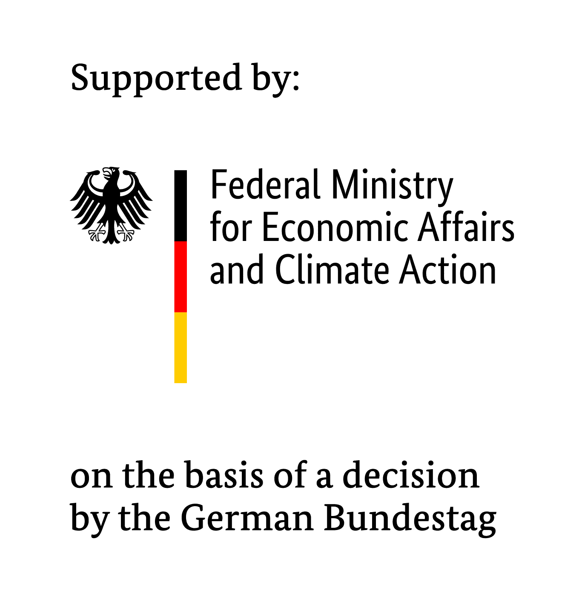

[](https://opensource.org/licenses/BSD-3-Clause)
[](https://rwth-ebc.github.io/AgentLib/main/coverage/)
[](https://rwth-ebc.github.io/AgentLib/main/pylint/pylint.html)
[](https://rwth-ebc.github.io/AgentLib/main/docs/index.html)


This is a collection of base classes for the implementation of agents in Python.
The original purpose of this library is the execution of distributed simulations and controllers for energy systems, however it is not limited to any specific field.
To get started, please check out our examples.

### Installation

To install the agentlib with minimal dependencies, run:

```
pip install agentlib
```

To install with full dependencies (recommended), run:
```
pip install agentlib[full]
```

If you want to work on the agentlib, first clone it, go its directory and then install it in editable mode:

```
pip install -e .[full]
```

## Optional Dependencies
The AgentLib has a number of optional dependencies, ranging from additional features to performance improvements:
 
 - **fmu**: Support simulation of FMU models (https://fmi-standard.org/).
 - **scipy**: Support simulation of linear state space models, based on scipy.
 - **mqtt**: Support communication between agents through the mqtt protocol.
 - **plot**: Installs matplotlib, allows to plot the result of examples.
 - **orjson**: Faster json library, improves performance when using network communicators.
 - **fuzz**: Improves error messages when providing wrong configurations.

**clonemap**: Support the execution of agents and their communication through [clonemap](https://github.com/sogno-platform/clonemap). As clonemapy is not available through PYPI, please install it from source, or through the AgentLib's ``requirements.txt`` .

## Referencing the AgentLib

A publication regarding the AgentLib is currently in the work.
A preprint is available under http://dx.doi.org/10.2139/ssrn.4884846 and can be cited as: 

> Eser, Steffen and Storek, Thomas and Wüllhorst, Fabian and Dähling, Stefan and Gall, Jan and Stoffel, Phillip and Müller, Dirk, A Modular Python Framework for Rapid Development of Advanced Control Algorithms for Energy Systems. Available at SSRN: https://ssrn.com/abstract=4884846 or http://dx.doi.org/10.2139/ssrn.4884846 

## Copyright and license

This project is licensed under the BSD 3 Clause License - see the [LICENSE](LICENSE) file for details.

## Acknowledgments

We gratefully acknowledge the financial support by Federal Ministry \\ for Economic Affairs and Climate Action (BMWK), promotional references 03ET1495A and 03EN1006A.


